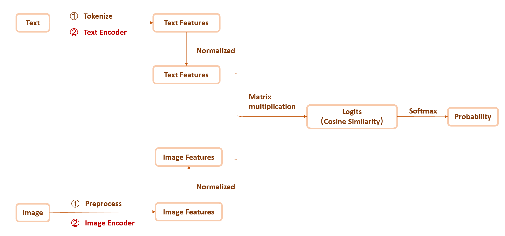
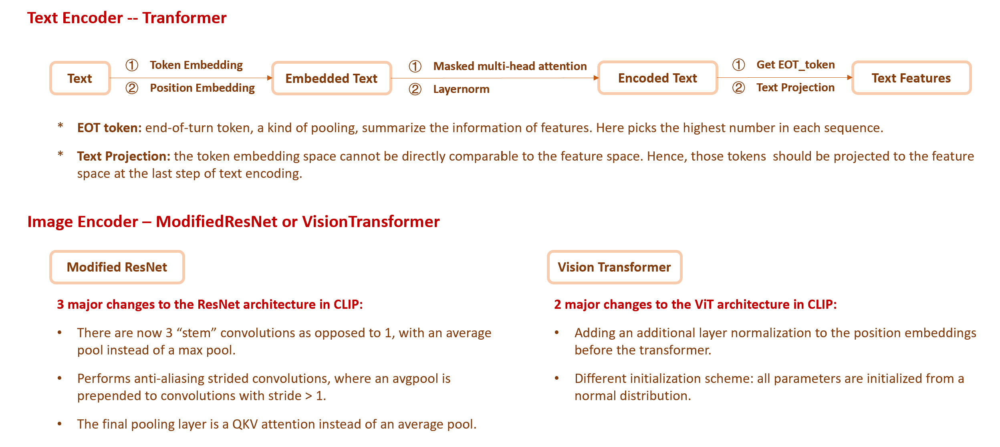

<div align='center' ><font size='70'><strong>Mindspore-CLIP Handbook</strong></font></div>

# Catalogue

- **[CLIP and its implementation](#CLIP and its implementation)**

  A brief introduction to the background of the CLIP model, including the theoretical approach and widely used code implementations of it.

  

- **[MindSpore-CLIP](#MindSpore-CLIP)**

  The usage, API and its check list,  and the code directory description of mindspore-version clip and open_clip, for reference in actual use.

  

- **[Inference Difference](#Inference Difference)**

  In order to prove the consistency of our implementation with the original one, the difference statistics of the inference results and its calculation method are presents this chapter.

<div STYLE="page-break-after: always;"></div>

# CLIP and implementation

[[Paper]](https://arxiv.org/abs/2103.00020) [[Source Code]](https://github.com/openai/CLIP)

CLIP (Contrastive Language-Image Pre-Training) is a neural network trained on a variety of (image, text) pairs. **It can be instructed in natural language to predict the most relevant text snippet, given an image**, without directly optimizing for the task, similarly to the zero-shot capabilities of GPT-2 and 3. Here's how it achieves this effect:


For more detailed information, please refer to [the official website](https://openai.com/research/clip).

There are 2 widely-recognized code Implementation of CLIP using PyTorch, one is [CLIP](https://github.com/openai/CLIP) itself from OpenAI, who introduced this network, and the other is [open_clip](https://github.com/mlfoundations/open_clip/tree/main) from ML Foundations. Here compares the two in terms of function and pretraining:

|                          | Training | Inference | Pretrain Dataset                       | Pretrain Model                          |
| ------------------------ | -------- | --------- | -------------------------------------- | --------------------------------------- |
| OpenAI-CLIP              | ❌        | ✅         | An undisclosed 400m dataset            | ResNet, ViT                             |
| ML Foundations-open_clip | ✅        | ✅         | LAION-400M, LAION-2B, DataComp-1B, etc | ResNet, ViT, ConvNeXt, RoBERTa-ViT, etc |

Now,  both OpenAI-CLIP and ML Foundations-open_clip have been migrated to MindSpore, and we've tried our best to keep the API and functions consistent with the source code.

# MindSpore-CLIP

## CLIP

[[Source Code]](https://github.com/openai/CLIP)[[MindSpore-CLIP]](https://github.com/openai/CLIP)

### Usage

#### Pre-treatment

Change the directory to where the MindSpore-CLIP is stored in the mindcv module, and install the necessary dependencies.

```bash
$ cd ./mindcv/examples/clip/
$ pip install -r requirements.txt
```
#### Appetizer

```python
import clip
from PIL import Image
from mindspore import Tensor,nn

# Load a pretrained clip model and transformation operations to the input images
# You can specify a model name returned by clip.available_models() or the path of ckpt file in clip.load()
model, preprocess = clip.load("./ViT-B-32.ckpt", device="Ascend")

# Preprocess to the input images and texts respectively
image = Tensor(preprocess(Image.open("CLIP.png")))
text = clip.tokenize(["a diagram", "a dog", "a cat"])

# Encode images and texts
image_features = model.encode_image(image)
text_features = model.encode_text(text)

# Calculate the cosine similarity, which indicates the predicted score of the labels
logits_per_image, logits_per_text = model(image, text)
probs = nn.Softmax(axis=-1)(logits_per_image).numpy()

print("Label probs:", probs)  # prints: [[0.9927937  0.00421067 0.00299571]]
```

More examples like zero-shot prediction and linear-probe evaluation, kindly refer to [Readme.md](https://github.com/mindspore-lab/mindcv/tree/main/examples/clip#more-examples).

### API

Most methods of MindSpore-CLIP are the same as the original CLIP, if there is anything different in argument, a table will display it in detail (✅ means totally the same while ❌ represents not supported yet).

#### clip

The CLIP module `clip` provides the following methods:

##### clip.available_models()

Returns the names of the available CLIP models.

##### clip.load(name, device, mode, download_root)

Returns the model and the transform operations needed to the image input, specified by argument `name`. It will download the model checkpoint as necessary.

Here's the argument comparison of `clip.load` in OpenAI-CLIP and MindSpore-CLIP:

| OpenAI-CLIP                                                  | MindSpore-CLIP                                               |
| ------------------------------------------------------------ | ------------------------------------------------------------ |
| **name** : str<br />A model name listed by `clip.available_models()`, or the path to a local model checkpoint containing the params_dict. | ✅                                                            |
| **device** : Union[str, torch.device] <br />The device to put the loaded model.<br />defalut: "cuda" if torch.cuda.is_available() else "cpu" | **device** : str<br />The device to put the loaded model, must be one of CPU, GPU, Ascend<br />default: "Ascend" |
| **jit** : bool<br />Whether to load the optimized JIT model or more hackable non-JIT model (default). | ❌                                                            |
| **download_root** : str<br />Path to download the model files.<br />default: "~/.cache/clip" | ✅                                                            |
| ❌                                                            | **mode** : int<br />GRAPH_MODE(0) or PYNATIVE_MODE(1).<br />default: 1 |

##### clip.tokenize(text, context_length, truncate)

Returns a tensor containing tokenized sequences of given text input(s), which can be used as the input of the model.

Here's the argument comparison of `clip.tokenize` in OpenAI-CLIP and MindSpore-CLIP:

| OpenAI-CLIP                                                  | MindSpore-CLIP |
| ------------------------------------------------------------ | -------------- |
| **texts** : Union[str, List[str]]<br />An input string or a list of input strings to tokenize. | ✅              |
| **context_length** : int<br />The context length to use; all CLIP models use 77 as the default context length. | ✅              |
| **truncate** : bool<br />Whether to truncate the text in case its encoding is longer than the context length.<br />default: False | ✅              |

#### model

The model returned by `clip.load()` supports the following methods:

##### model.encode_image(image)

Given a batch of images (Tensor), returns the image features (Tensor) encoded by the vision portion of the CLIP model.

##### model.encode_text(text)

Given a batch of text tokens (Tensor), returns the text features (Tensor) encoded by the language portion of the CLIP model.

##### model(image, text)

Given a batch of images (Tensor) and a batch of text tokens (Tensor), returns two Tensors, containing the logit scores corresponding to each image and text input. The values are cosine similarities between the corresponding image and text features, times 100.

### Something for Developer

#### Code Architecture






#### Directory description

```bash
.
├── clip                                     //Stores model files for components of clip
│   ├── bpe_simple_vocab_16e6.txt.gz         //default bpe used in text tokenizer
│   ├── clip.py                              //The uppermost interface of clip module, including load, tokenize and other APIs to realize clip functions
│   ├── __init__.py                          //Init file
│   ├── model.py                             //The structure of clip, design the network of encoders
│   └── simple_tokenizer.py                  //desigh text tokenizer
├── CLIP.png                                 //A diagram of clip principle and can also be used for sample code
├── data                                     //Stores introductions of prompts and CV datasets used in the paper
│   ├── country211.md
│   ├── prompts.md
│   ├── rendered-sst2.md
│   └── yfcc100m.md
├── MANIFEST.in                              //Used to pack default bpe into clip module
├── model-card.md                            //An introduction of CLIP model
├── README.md                                //An introduction of this module
├── requirements.txt                         //requirements file
├── tests									 
│   └── test_consistency.py                  //Test file of critical API
└── ckpt_transform.py                        //A tool of transforming a PyTorch checkpoint file to a MindSpore .ckpt format
```

## open_clip

[[Source Code]](https://github.com/mlfoundations/open_clip/tree/main)[[MindSpore-open_clip]](https://github.com/mlfoundations/open_clip/tree/main)

### Usage

#### Pre-treatment

Change the directory to where the MindSpore-CLIP is stored in the mindcv module, and install the necessary dependencies.

```bash
$ cd ./mindcv/examples/open_clip/
$ pip install -r requirements.txt
```

#### Appetizer

```python
from src.open_clip import create_model_and_transforms, get_tokenizer
import mindspore as ms
from PIL import Image
from mindspore import Tensor, ops

# Set context for running environment.
ms.set_context(device_target="Ascend", mode=0)

# Load a pretrained clip model and transformation operations to the input images
# Similar to `clip.load`
model, preprocess_train, preprocess_val = create_model_and_transforms(
    "RN50",
    "yfcc15m",
    force_quick_gelu=False,
    force_custom_text=False,
    force_patch_dropout=None,
    force_image_size=None,
    image_mean=None,
    image_std=None,
    aug_cfg={},
)

# Set a tokenizer according to the given model's text config
tokenizer = get_tokenizer("RN50")

# Preprocess to the input images and texts respectively
image = Tensor(preprocess_train(Image.open("CLIP.png")))
text = tokenizer(["a diagram", "a dog", "a cat"])

# Encode images and texts
image_features = model.encode_image(image)
text_features = model.encode_text(text)

# Different with CLIP module, features are normalized manually and independently
image_features /= image_features.norm(dim=-1, keepdim=True)
text_features /= text_features.norm(dim=-1, keepdim=True)

# Calculate the cosine similarity, which indicates the predicted score of the labels
text_probs = ops.softmax(100.0 * image_features @ text_features.T, axis=-1)
```

More examples like zero-shot prediction and linear-probe evaluation, kindly refer to [Readme.md](https://github.com/mindspore-lab/mindcv/tree/main/examples/open_clip#more-examples).

### Directory description

```bash
.
├── difference.py                                                   //Scripts of calculating difference statistics between source code and MindSpore version
├── docs                                                            //Tutorials and diagrams
│   ├── clip_conceptual_captions.md
│   ├── clip_loss.png
│   ├── Interacting_with_open_clip.ipynb
│   ├── ...
│   └── script_examples
│       └── stability_example.sh
├── LICENSE                                                         //License of source code
├── MANIFEST.in                                                     //Used to pack default bpe and model configs into clip module
├── README.md                                                       //Introduction and usage of this module
├── requirements-test.txt                                           //Requirements file
├── requirements-training.txt
├── requirements.txt
├── src                                                             //Stores everything about clip itself (definitioan and training)
│   ├── open_clip                                             //Model files for components of clip
│   │   ├── bpe_simple_vocab_16e6.txt.gz				//default bpe used in text tokenizer
│   │   ├── constants.py								//OpenAI default mean and std in normalization of imgae transformation
│   │   ├── factory.py									//The uppermost interface of open_clip module, including create_model_and_transforms, get_tokenizer and other APIs to realize clip functions
│   │   ├── __init__.py									//Init file
│   │   ├── loss.py										//All loss function might be used in training
│   │   ├── model_configs								//Model configs from ML Foundation-open_clip
│   │   │   └── ...
│   │   ├── model.py									//The structure of clip, design the network of encoders
│   │   ├── modified_resnet.py                          //Modified ResNet used for image encoder
│   │   ├── openai.py									//Load pretarined models only from OpenAI-CLIP
│   │   ├── pretrained.py								//Stores urls of pretrained ckpt and any functions about load pretrained model
│   │   ├── tokenizer.py								//desigh text tokenizer
│   │   ├── transformer.py								//The most basic transformer used to build CLIP model
│   │   ├── transform.py								//Image transformation operations
│   │   ├── utils.py									//Other commonly used tool functions
│   │   ├── zero_shot_classifier.py						//Build zero-shot classifier
│   │   └── zero_shot_metadata.py						//ImageNet class names and templates used in zero-shot
│   └── training                                              //Training scripts, on the road...
│       └── ...
├── test.py                                                         //Scripts of generating results of test example
└── tests                                                           //Test file of critical API, involves in training scripts, hence on the road...
    └── ...
 
```

### API

Most methods of MindSpore-open_clip are the same as the original one, if there is anything different in argument, a table will display it in detail (✅ means totally the same while ❌ represents not supported yet).

#### open_clip

The open_clip module `open_clip` provides the following methods:

##### open_clip.list_pretrained(as_str)

Returns a list of tuple (pretrained_model_name, pretrain_tag) by default or 'name:tag' if as_str == True.

##### open_clip.list_models()

Enumerate available model architectures in a list based on config files.

##### open_clip.get_tokenizer(model_name)

Return the tokenizer to be used of given model.

##### open_clip.decode(output_ids)

Text decoder, usually used in CoCa model.

##### open_clip.create_model_and_transforms(model_name, pretrained, force_quick_gelu, force_custom_text, force_patch_dropout, force_image_size, cache_dir)

Similar to [`clip.load`](#####clip.load(name, device, mode, download_root)), returns the model and the transform operations needed to the image input, specified by argument `model_name`. It will download the model checkpoint as necessary.

Here's the argument comparison of `open_clip.create_model_and_transforms` in ML Foundations-open_clip and MindSpore-open_clip:

| ML Foundations-open_clip                                     | MindSpore-open_clip |
| ------------------------------------------------------------ | ------------------- |
| **model_name** : str<br />A model name listed by `open_clip.list_models()`, or the path to a local model checkpoint containing the params_dict. | ✅                   |
| **pretrained** : str<br />Tag of pretrained model or the local path of pretrained checkpoint. | ✅                   |
| **precision** : str<br />Model precision.<br />default: 'fp32' | ❌                   |
| **device** : Union[str, torch.device] <br />The device to put the loaded model.<br />defalut: "cpu" | ❌                   |
| **jit** : bool<br />Whether to load the optimized JIT model.<br />default: False | ❌                   |
| **force_quick_gelu** : bool<br />Whether to replace the `nn.GELU` with `QuickGELU`. (p.s. OpenAI-CLIP pretrained all the models with `QuickGELU` while in recent versions of PyTorch, this activation is actually less efficient that native torch.nn.GELU.)<br />default: False | ✅                   |
| **force_custom_text** : bool<br />Whether to have the classes embedded by the text encoder in a zero-shot learning.<br />default: False | ✅                   |
| **force_patch_dropout** : float<br />What fraction of patches to dropout during training (0 would mean disabled and no patches dropped) - 0.5 to 0.75 recommended in the paper for optimal results. | ✅                   |
| **force_image_size** : Union[int, Tuple[int, int]]<br />The size of the input images to be transformed to. | ✅                   |
| **pretrained_image** : bool<br />Use (imagenet) pretrained weights (only) for named timm models.<br />default: False | ❌                   |
| **pretrained_hf** : bool<br />Whether the text encoding model from Hugging Face has been pretrained.<br />default: True | ❌                   |
| **image_mean** : Tuple[float, ...]<br />Mean to be used in normalization of image transform operations. | ✅                   |
| **image_std** : Tuple[float, ...]<br />Standard deviation to be used in normalization of image transform operations. | ✅                   |
| **aug_cfg** : Union[Dict[str, Any], AugmentationCfg]<br />Augmentation configs to be used to the input images. | ✅                   |
| **cache_dir** : str<br />The directory to cache the downloaded model weights. | ✅                   |
| **output_dict** : bool<br />Return the results themselves or as a dictionary. | ❌                   |

#### model

The model returned by `open_clip.create_model_and_transforms()` supports the following methods:

##### model.encode_image(image)

Given a batch of images (Tensor), returns the image features (Tensor) encoded by the vision portion of the CLIP model.

##### model.encode_text(text)

Given a batch of text tokens (Tensor), returns the text features (Tensor) encoded by the language portion of the CLIP model.

##### model(image, text)

Given a batch of images (Tensor) and a batch of text tokens (Tensor), returns three Tensors, containing the encoded features corresponding to each image and text input as well as the logit scale values.

> ❗Note: this method returns different results from it in CLIP.

# Inference Difference

In order to cover all of the above API with a small computational cost, the first example in `./readme.md` were adopted to calculate the difference statistics between source code and our version.

```python
from PIL import Image
import mindspore as ms
from mindspore import Tensor,nn
import clip

ms.set_context(device_target="Ascend", mode=1)
model, preprocess = clip.load("RN50", device="Ascend")

image = Tensor(preprocess(Image.open("CLIP.png")))
text = clip.tokenize(["a diagram", "a dog", "a cat"])

image_features = model.encode_image(image)
text_features = model.encode_text(text)

logits_per_image, logits_per_text = model(image, text)
probs = nn.Softmax(axis=-1)(logits_per_image).numpy()

print("Label probs:", probs)
```

In terms of encoding method, as both ResNet and ViT can be used to encode images, while texts will only be encoded by a transformer, the difference statistics consist of 2 parts, **one for ResNet image encoder, the other for ViT**.

Among the results generated by the example, we only select **`image_features`, `text_features` and `probs`** for comparison, as they are the three most critical results in the model.

The difference is presented as the **absolute difference and the relative difference**, which are calculated as follows:

$$
abs \ diff =mean(|results_{pt}-results_{ms}|)\\
rel \ diff =mean(\frac{|results_{pt}-results_{ms}|}{|results_{pt}|+1e^{-6}})
$$
Last but not least, only **Ascend+MindSpore and GPU+PyTorch** are compared in this chapter, and all code on MindSpore ran in the **GRAPH mode**.

> FYI: The above test examples and difference statistics calculation code are in the folder./example/open_clip/, **test.py** for generating and saving results and **difference.py** for statistics calculation. Welcome to have a try.

## CLIP

### Image encoder--ResNet50

|                     | image_features | text_features | probs      |
| ------------------- | -------------- | ------------- | ---------- |
| Absolute Difference | 0.00014024     | 0.00033297    | 0.00005080 |
| Relative Difference | 1.89662%       | 0.99895%      | 0.61126%   |

### Image encoder--ViT-B-32

|                     | image_features | text_features | probs      |
| ------------------- | -------------- | ------------- | ---------- |
| Absolute Difference | 0.00071072     | 0.00025951    | 0.00005770 |
| Relative Difference | 1.45557%       | 0.81902%      | 0.52820%   |

## open_clip

### Image encoder--ResNet50

#### ckpt source--OpenAI

|                     | image_features | text_features | probs      |
| ------------------- | -------------- | ------------- | ---------- |
| Absolute Difference | 0.00008979     | 0.00051654    | 0.00003248 |
| Relative Differe    | 1.22642%       | 2.31994%      | 0.30192%   |

#### ckpt source--ML Foundation & Dataset--YFCC 15m

|                     | image_features | text_features | probs      |
| ------------------- | -------------- | ------------- | ---------- |
| Absolute Difference | 0.00055126     | 0.00075564    | 0.00194565 |
| Relative Difference | 0.44998%       | 1.51225%      | 0.80727%   |

### Image encoder--ResNet50×64

#### ckpt source--OpenAI

|                     | image_features | text_features | probs      |
| ------------------- | -------------- | ------------- | ---------- |
| Absolute Difference | 0.00090105     | 0.00063068    | 0.00038379 |
| Relative Difference | 2.21315%       | 1.25737%      | 0.92997%   |

### Image encoder--ViT-B-32

#### ckpt source--OpenAI

|                     | image_features | text_features | probs      |
| ------------------- | -------------- | ------------- | ---------- |
| Absolute Difference | 0.00092272     | 0.00032371    | 0.00004114 |
| Relative Difference | 1.41578%       | 1.21768%      | 0.72396%   |

#### ckpt source--ML Foundation & Dataset--laion2B

|                     | image_features | text_features | probs      |
| ------------------- | -------------- | ------------- | ---------- |
| Absolute Difference | 0.00100795     | 0.00052981    | 0.00000438 |
| Relative Difference | 1.83331%       | 1.35017%      | 1.46012%   |

### Image encoder--ViT-H-14

#### ckpt source--ML Foundation & Dataset--LAION 2B

|                     | image_features | text_features | probs      |
| ------------------- | -------------- | ------------- | ---------- |
| Absolute Difference | 0.00145688     | 0.00059179    | 0.00003984 |
| Relative Difference | 1.82030%       | 0.90787%      | 0.28105%   |

### Image encoder--ViT-bigG-14

#### ckpt source--ML Foundation & Dataset--LAION 2B

|                     | image_features | text_features | probs      |
| ------------------- | -------------- | ------------- | ---------- |
| Absolute Difference | 0.01203312     | 0.00274894    | 0.00024528 |
| Relative Difference | 8.85838%       | 1.68820%      | 8.06613%   |

> After analysis, the differences above are mainly caused by the parameter update strategy of `nn.BatchNorm2d` and the default weight initialization of `nn.Conv2d`, which are existing acceptable differences according to the MindSpore website.